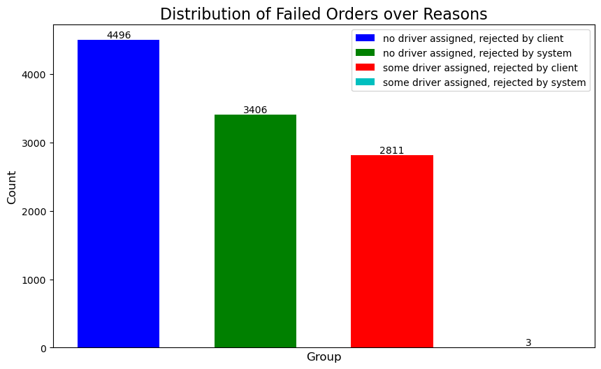
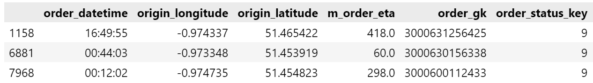
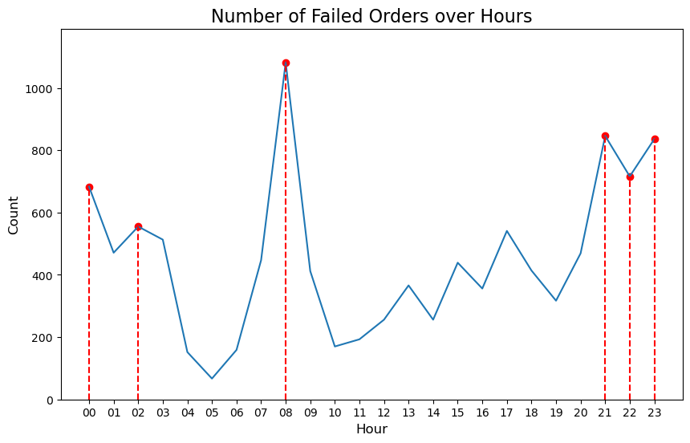
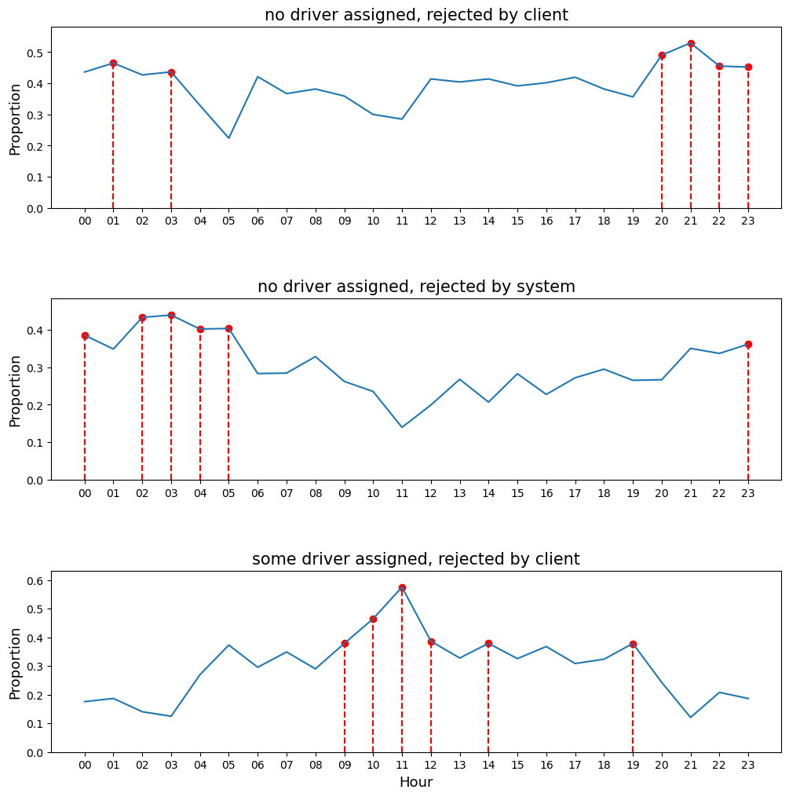
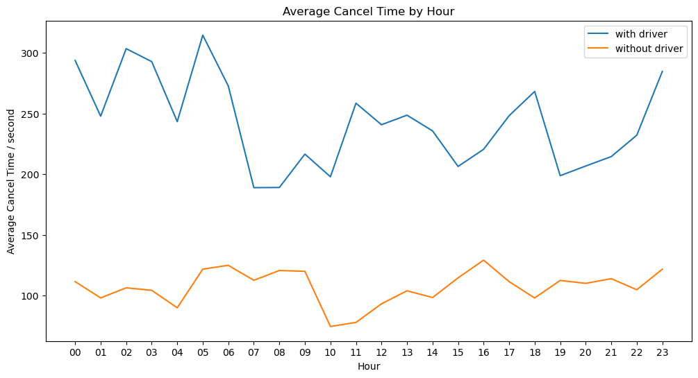
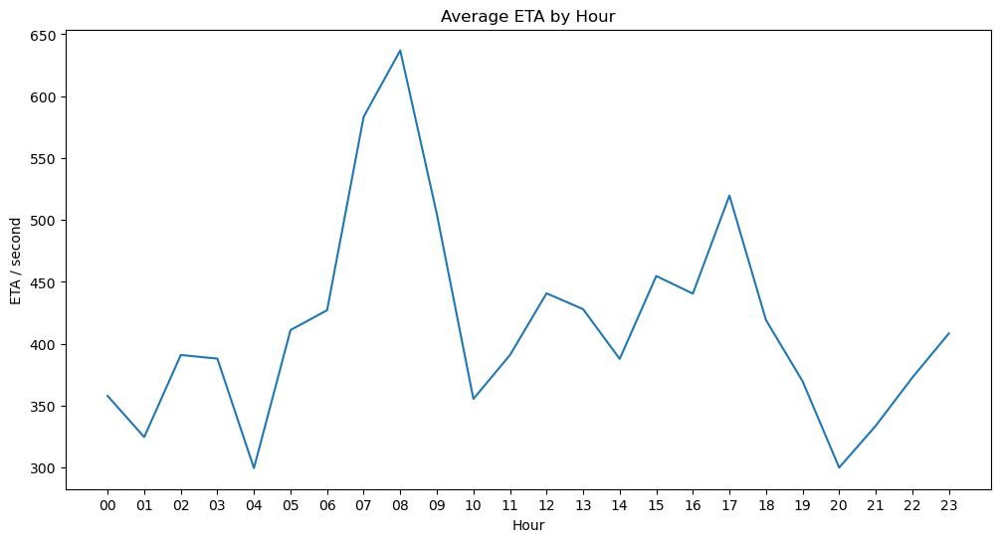

# HW2
# 12110820 胡嘉维
## 1. Distribution of Order Fails
The fail orders can be grouped by `order_status_key` and `is_driver_assigned_key`.
+ `is_driver_assigned_key` = 0, `order_status_key` = 4: no driver assigned, rejected by client;
+ `is_driver_assigned_key` = 0, `order_status_key` = 9: no driver assigned, rejected by system;
+ `is_driver_assigned_key` = 1, `order_status_key` = 4: some driver assigned, rejected by client;
+ `is_driver_assigned_key` = 1, `order_status_key` = 9: some driver assigned, rejected by system.

We see that the most common case for order fails is the ones rejected by the client before being accepted by the driver. There are also rare cases (only 3 appearances) that an order has been assigned to a driver but is rejected by the system later. And we have no evidence to judge such records as abnormal data.

## 2. Distribution of Order Fails by Hours
Plot the hourly fail orders in one day and find the top 6.

The hours with the most order fails are 8:00 ~ 9:00 and those in the late night, 21:00 ~ 2:00. It seems that 8:00 ~ 9:00 is the morning rush hour, 21:00 ~ 22:00 is the night rush hour, and afterward (22:00 ~ 2:00) the drivers go home for a rest.

Now plot the hourly proportion of different fail reasons. For each fail reason, highlight the hours with top 6 proportions. Since only 3 records are of the type `is_driver_assigned_key` = 1, `order_status_key` = 9, we ignore this type.

Here we can see that the three types:
1. no driver assigned, rejected by client
2. no driver assigned, rejected by system
3. some driver assigned, rejected by client

all have their own peak times in the sence of proportion, with type-1 in the evening (20:00 ~ 23:00), type-2 in the late night (0:00 ~ 5:00) and type-3 in the late morning (9:00 ~ 12:00). 

Here is a possible explanation for this phenominon. In the evening, the potential offers of taxi decreases and the impatient clients (who rush for dinner, entertainment and rest) withdraw their orders, resulting a type-1 failure; in the late night, the offers are even less but the clients (who has been already away from the bedtime routine) are more willing to wait, resulting a type-2 failure; in the morning, the offers increase, but the clients (who rush for work or later rush for lunch) are even more impatient, hence they would reject some unsatisfactory offers, resulting a type-3 failure.

## 3. Average Cancel Time by Hour

After removing the outliers (those beyond the [Q(0.25)-1.5IQR, Q(0.75)+1.5IQR]), plot the average cancel time by hour, with and without driver assigned:

We can explain this plot by the following:
+ Once a driver has been assigned, the client turn to wait for the arrival, although they will still reject the order if the driver is too late. Hence the cancel time in the cases when a driver has been assigned is much longer than those when no driver has been assigned.
+ The blue line shows the patience of client for waiting a matched driver, while the orange line shows the patience for finding a taxi. The orange line is relatively stable except that in the late morning (10:00 ~ 12:00) the curve reaches its valley. This indicates that the clients are much less patient in the morning rush hour than in other time periods of a day (they feel so emergent that they will quickly turn to other commutes), which is consistent with the analysis in task 2 (type-3 failure). 
+ However, in the same period of time, the blue line does not act as the same way. This indicates that the clients become more patient once they have found a driver, and this willingness even reaches a small peak during the whole day, showing the increasing demand for taxi in this period.
+ For the blue line, the evening (19:00 ~ 23:00) is another valley, indicating that the clients are less patient in this period, consistent with the analysis in task 2 (type-1 failure); the late night (23:00 ~ 5:00) is another peak, showing that under the low supply of taxi, the clients become patient again, consistent with the analysis in task 2 (type-2 failure).

## 4. Average ETA by Hour

This plot quantify the difficulty of finding a taxi over the day, also coincident with the morning-evening-peak pattern. 

