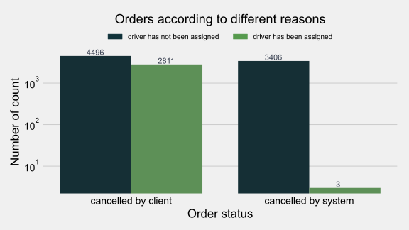
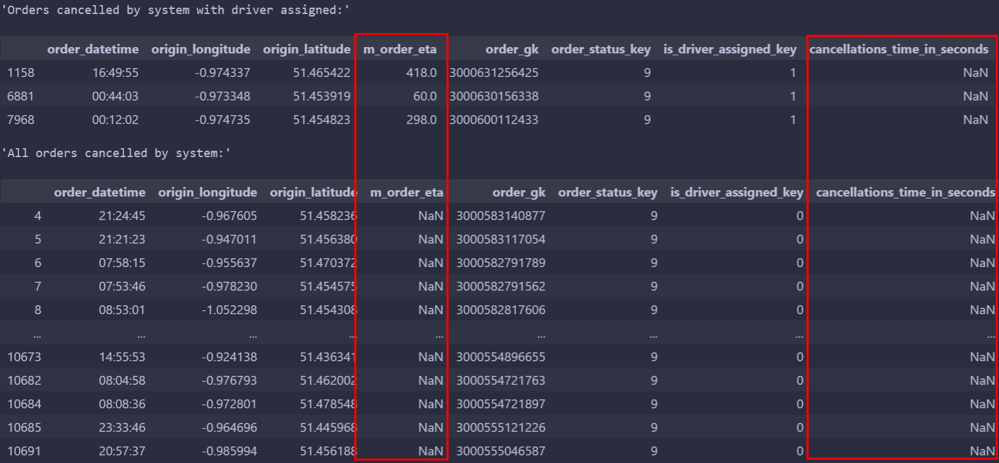
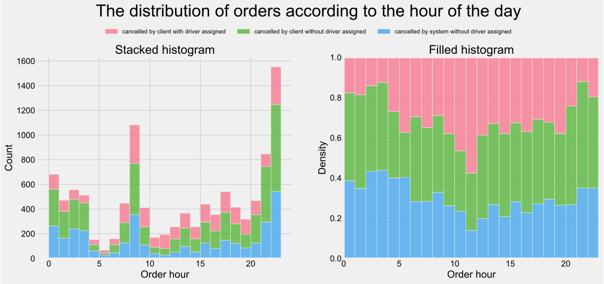
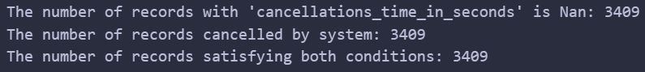
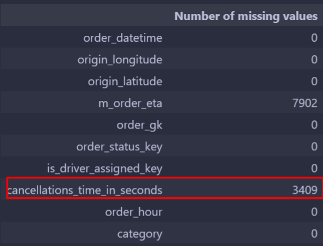
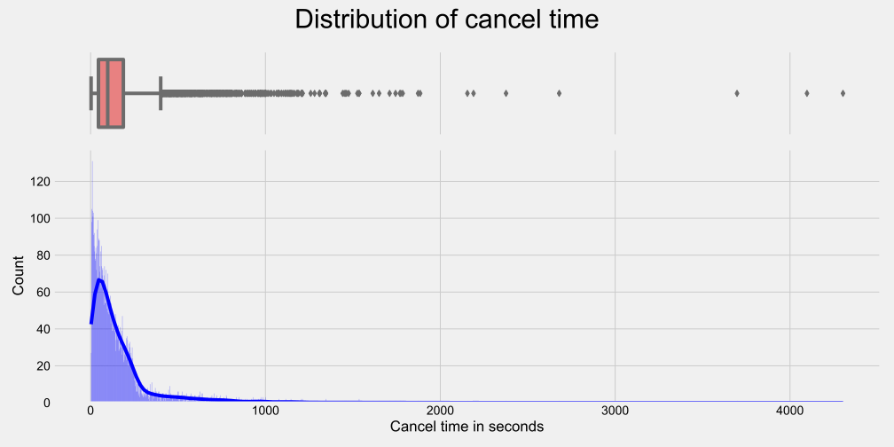
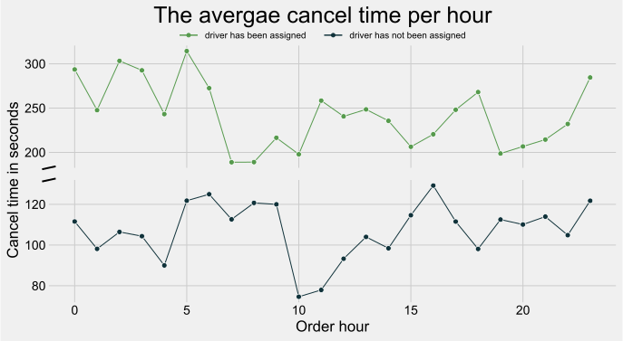
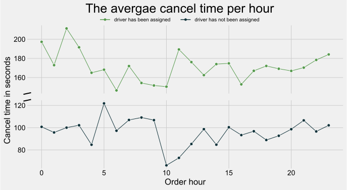
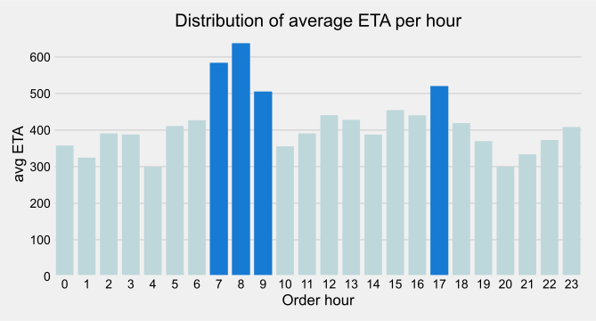

# Data Science Practice Assignment 2 report

**SID**: 12110821
**Name**: Zhang Chi

## Q1
In this bar chart, there are two categories of order status (the order cancelled by the client or the system), which are set in x-axis. In each category, separated into two groups (whether has assigned a driver or not), the number of orders is counted and displayed on the top of each bar.

According to the image above, the number of orders cancelled by the client is larger than the number of orders cancelled by the system, with the order that no driver assigned account for more in both categories. Besides, the most orders are cancelled by the client without assigning a driver, which is 4496.

However, there are 3 orders cancelled by system even though the driver has been assigned, which is the least among all the categories. And I get details and display below, from which we can find that these three's `cancellations_time_in_seconds` are Nan while `m_order_eta` are not Nan. Perhaps the driver get to the pick-up point but the client was gone, so the system cancelled the order.

## Q2
There are 

## Q3

### Checking missing values

Based on the table information (presented below), all missing values of `cancellations_time_in_seconds` are caused by the reason that the order was cancelled by system, which is a regular missing type.

What's more, when using the `groupby` and `agg` functions, if there are missing values in the data, the pandas library automatically ignores those missing values and calculates the average of the non-missing values. Therefore, we can feel free to make the analysis.

### Before deleting outliers

### After deleting outliers
It is clear that many outliers. So I will filter them by using the `1.5 IQR` criteria. As the mean is not the same in two groups, I will make it separately.

## Q4

## Q5

<iframe src="../output/Q4_map.html" width="80%" height="500px"></iframe>

